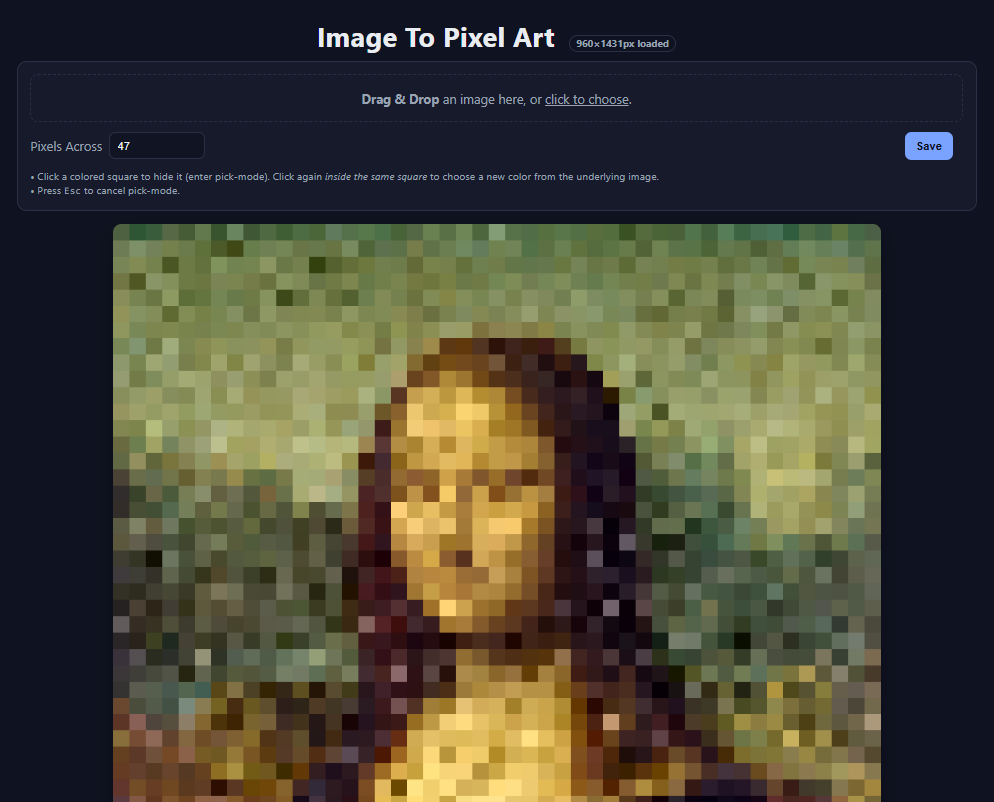

# Image To Pixel Art

> Click the image above to try it live on GitHub Pages.

---

## About

A simple browser-based tool that converts an image into pixel art using an adjustable grid.  
You can set how many pixels wide the pixel art should be, and the script automatically adjusts the height to match.  
Pixels are colored based on the color of the original image at the center of each square, but you can click on any square to change the color sampling point within eachh square.  

---

## How to Use

1. Open the app on [GitHub Pages](https://camelcasesensitive.github.io/Image-To-Pixel-Art/).  
2. Drag and drop or upload an image.  
3. Adjust the **Pixels Across** value to change pixel size.  
4. Click the squares to fine-tune colors.  
5. Click **Save** to download your pixel art.

---
